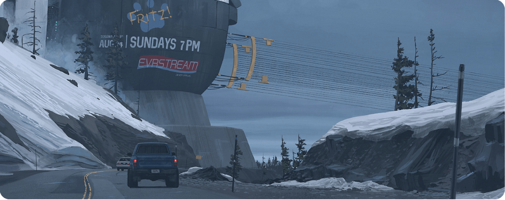

# Hi there, I'm Christan Hare 👋

I'm a passionate full-stack software engineer with a background in Electronic and Electrical Engineering, skilled in web development, software engineering, graphics and interactive media across anumber of diverse industries.

- 🔭 Currently working on mastering TypeScript, React, and Next.js
- 🌱 Always learning and improving my skills
- 👯 A strong believer in collaboration and teamwork
- 📫 How to reach me: cmhleveret@gmail.com
- 😄 Pronouns: He/Him
- ⚡ Fun fact: I enjoy CAD/CAM, 3D modeling and animation in my free time

## 🛠 Skills

- Full Stack Web Development
- Electronic and Electrical Engineering
- Programming Languages: HTML, CSS, TypeScript, JavaScript, Java, Python, C/C++
- Project Management and Agile Methodologies (CSM Certified Scrum Master)
- Frameworks and Libraries: React, Bootstrap, Node, Next.js, TRPC, Tailwind.css, Express, Spring Boot, Three.js, CanvasSketch, WebGL, React Native
- Version Control (Git)
- Design and Prototyping Tools: Figma, Trello, Blender, Fusion 360, Metashape
- Audio/Visual Editing and Design. Adobe Suite: Photoshop, After Effects, Animate, Illustrator
- Microcontroller Programming (Arduino, Raspberry Pi, ESP)

## 📚 Education
- Full Stack Web development bootcamp provided bt Ey-Up & WanDisco
- First Class, BEng (Hons) Electronic & Electrical Engineering, University of Sheffield, Sheffield, UK (2016-2020)

## 💼 Employment History

- Full Stack Software Engineer at EyUp Coding Academy (Sept 2022 - Dec 2022)
- Director and Owner at CMLeveret LTD (2020 - present)
- On-Location VFX Technician at VisualSkies LTD (Jan 2022 - May 2022)
- Graphics Playback Technician at RevolverAV LTD (June 2019 - present)

## 🌐 Find me online

- Personal Website: www.cmleveret.dev
- GitHub: github.com/cmhleveret
- Twitter: @ChristanHare

## 🏆 Projects & Portfolio

- [360 Video Mapping Art Installation](https://cmhleveret.github.io/Morgan360/)
- [Reactive Album Artwork](https://cmhleveret.github.io/Sam-Music-video/)
- [IoT Startup Collaboration](http://iot.unphone.net/)
- [Portfolio Website](https://cmhleveret.github.io/portfolio-example/)
- [Note Taking App](https://cmhleveret.github.io/collector/)
- [Dough Joe's Pizza App](https://cmhleveret.github.io/createpizza)
- [Polling App](https://github.com/cmhleveret/voting-app)
- [Text-based Adventure Game](https://tinyurl.com/8ee6mxns)
- [Social Media Back End](https://github.com/cmhleveret/simple-fb-java-backend)
- [Desk Booking App](https://github.com/cmhleveret/Desk-Booking-App)
- [Live Restful API’s](https://github.com/cmhleveret/serverlessAPI)
